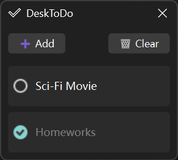

# Desk To Do

**Desk To Do** - A lightweight desktop TODO reminder.

**Download:** [GitHub Release](https://github.com/AnpyDX/DeskToDo/releases)



## Features

- **Persistent Local History**  
  Your TODO list is automatically saved to local storage and restored on next launch.

- **Customizable Theme via Config File**  
  Modify `appdata/config.toml` to personalize colors, appearance, and visual style.

> **Note**  
> The feature that synchronizes the title bar color with the window background relies on Windows DWM APIs and is only available on **Windows 11 Insider Preview build 22000 or higher**. On older Windows versions the title bar will use the system default style.

## Build from Source

### Requirements

- Qt6 SDK
- CMake 4.0+
- Compiler with C++20 support

### Compilation

Run following commands to start compiling for executable:

```bash
cmake -B build -DCMAKE_BUILD_TYPE=Release
cmake --build build --config Release
```

> NOTE: Windows users should specify Qt6-SDK by `-DCMAKE_PREFIX_PATH=YOUR_QT_SDK_PATH`.

After a successful build, copy the `assets/appdata` directory into the same folder as the compiled executable.

## Third-party

- **toml11**: <https://github.com/ToruNiina/toml11> (MIT License)

- **App Icon**: <https://github.com/google/material-design-icons> (Apache License 2.0).

## License

Licensed under the MIT license, check [LICENSE](LICENSE) for details.
